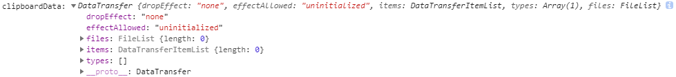
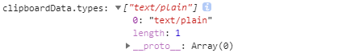
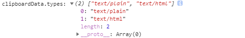
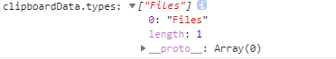
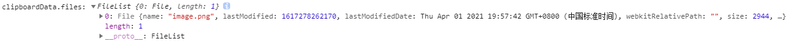
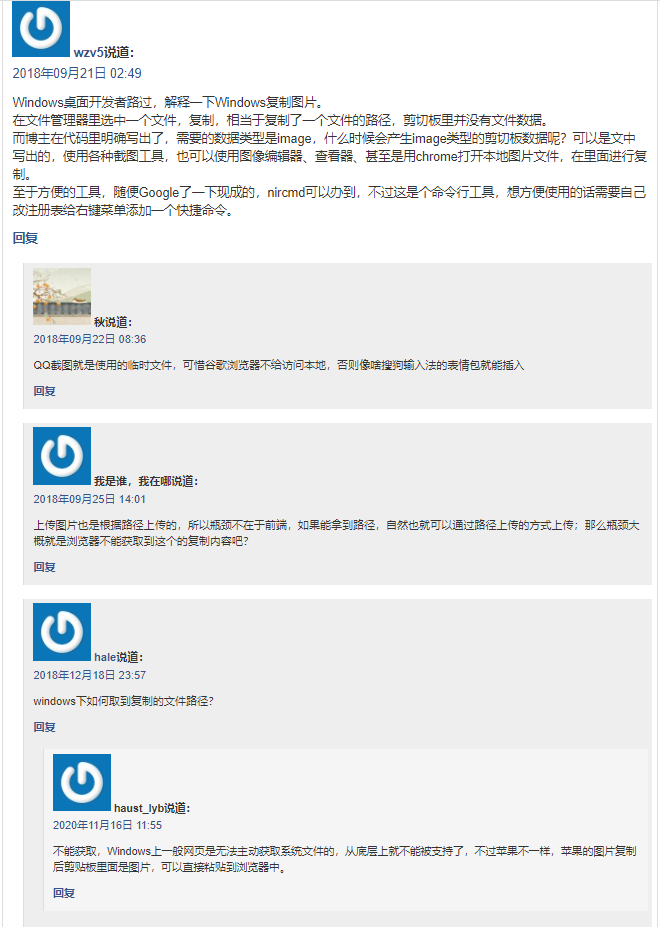
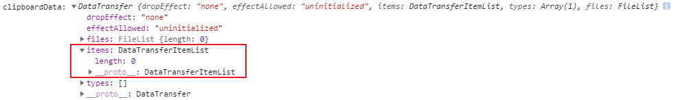
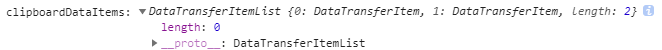
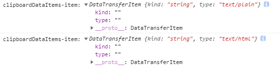
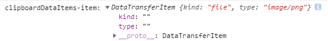

### 粘贴事件和剪切板

```js
document.addEventListener('paste', event => {
   const clipboardData = event.clipboardData
   const clipboardDataItems = clipboardData && clipboardData.items
   console.log('clipboardData:', clipboardData)
})
```



- 粘贴事件触发时，可以从event里获取到clipboardData。
- ClipboardEvent.clipboardData：一个 DataTransfer 对象，它包含了由用户发起的 cut、copy和paste操作影响的数据， 以及它的 MIME 类型。
- **ClipboardEvent.clipboardData**属性保存了一个 [`DataTransfer`](https://developer.mozilla.org/zh-CN/docs/Web/API/DataTransfer) 对象，这个对象可用于：
  - 描述哪些数据可以由 `cut` 和 `copy` 事件处理器放入剪切板，通常通过调用 [`setData(format, data)`](https://developer.mozilla.org/zh-CN/docs/Web/API/DataTransfer/setData) 方法；
  - 获取由 `paste` 事件处理器拷贝进剪切板的数据，通常通过调用 [`getData(format)`](https://developer.mozilla.org/zh-CN/docs/Web/API/DataTransfer/getData) 方法。

***疑问***：既然是粘贴，那就可以粘贴纯文本、html、图片等，那要如何区分本次粘贴的内容是哪种类型/格式的呢？

答1：利用`event.clipboardData.types`可获取类型数组，里面存储着此次粘贴内容的类型。比如：

```js
document.addEventListener('paste', event => {
   const clipboardData = event.clipboardData
   console.log('clipboardData.types:', clipboardData.types)
})
```

1. `Ctrl + c`复制一段纯文本，然后粘贴，触发paste事件，控制台打印出`clipboardData.types: ["text/plain"]`。

   

2. `Ctrl + c`复制一段html文本（暂可理解为网站中带标签或带样式的文本），然后粘贴，触发paste事件，控制台打印出`clipboardData.types: (2) ["text/plain", "text/html"]`。

   

   **注意**：粘贴html文本会打印出两个类型（text/plain, text/html）。

3. 用截图工具截图+复制，然后粘贴，触发paste事件，控制台打印出`clipboardData.types: ["Files"]`。

   

   此时可通过`event.clipboardData.files[0]`拿到剪切板中图片的file对象。

   

   （也可通过另一种方法拿到file对象，下面会讲到。）

   **注意**：直接去复制系统里的图片是没有用的。

   

   虽然答1中所说的通过`event.clipboardData.files[0]`可判断类型，但我一般不用这个，而是用答2的方法。

答2：利用`event.clipboardData.items`判断此次粘贴内容的类型。



- ` DataTransferItemList` 对象是一组代表被拖动项的[`DataTransferItem`](https://developer.mozilla.org/zh-CN/docs/Web/API/DataTransferItem) 对象的**列表**。
- 列表中的每一项存储着相应信息，因此需要遍历每一项。

```js
document.addEventListener('paste', event => {
   const clipboardData = event.clipboardData
   const clipboardDataItems = clipboardData && clipboardData.items
   console.log('clipboardDataItems:', clipboardDataItems)
})
```

1. `Ctrl + c`复制一段纯文本，然后粘贴，触发paste事件，控制台打印如下：

   

   但是这样压根儿看不到什么有用的信息，` DataTransferItemList` 未展开时，能看出里面有两项DataTransferItem，但一展开啥都没有了，length也变成0了。这里需要我们去手动遍历每一项：

   ```js
   pasteBox.addEventListener('paste', event => {
       const clipboardData = event.clipboardData
       const clipboardDataItems = clipboardData && clipboardData.items
       console.log('clipboardData:', clipboardData)
       console.log('clipboardDataItems:', clipboardDataItems)
       // 检索剪切板items
       for (var i = 0; i < clipboardDataItems.length; i++) {
          console.log('clipboardDataItems-item:', clipboardDataItems[i])
       }
   })
   ```

   

   从这里可以看到DataTransferItem 中有两个属性，`kind`和`type`。这个type属性便可以帮我们判断粘贴内容的类型。

2. `Ctrl + c`复制一段html文本（暂可理解为网站中带标签或带样式的文本），然后粘贴，触发paste事件，控制台打印出：

   

   这里说明一下，为什么会有这种html文本。其实我们到某网站复制一段文本，基本上都会将这段文本原本在原网站中具有的样式和标签都复制过来，导致我们粘贴到输入框中的文本是带有原网站样式的文本。

   如果是想获得纯文本，可通过`DataTransfer.getData(format)`获取

   ```js
   pasteBox.addEventListener('paste', event => {
       event.preventDefault() // 阻止默认的粘贴事件
       const text = (e.clipboardData || window.clipboardData).getData('text')
       // 这里拿到的text就是纯文本了
   })
   ```

   

3. 用截图工具截图+复制，然后粘贴，触发paste事件，控制台打印出：

   

   注意：这里获取到被粘贴内容的type的值为`image/png`，说明是图片。

   而答1中粘贴图片通过`event.clipboardData.types`获取到的值是`Files`，`Files`不一定能说明被粘贴的内容就是图片，比如粘贴excel的时候也会打印出`Files`（`["text/plain", "text/html", "text/rtf", "Files"]`）。

   这里介绍另一种获取粘贴图片file对象的方式：

   ```js
   pasteBox.addEventListener('paste', event => {
       const clipboardData = e.clipboardData
       const clipboardDataItems = clipboardData && clipboardData.items
   
       let file = null
       // 检索剪切板clipboardDataItems
       for (var i = 0; i < clipboardDataItems.length; i++) {
           console.log('clipboardDataItems-item-type:', clipboardDataItems[i].type)
           if (clipboardDataItems[i].type.indexOf('image') === -1) return
           file = clipboardDataItems[i].getAsFile()
           break
      }
      // 通过这种方式也能拿到被粘贴图片的file对象
      console.log('file:', file)
      // 两种方法都能拿到图片的file对象
      // console.log('clipboardData.files:', clipboardData.files[0])
   })
   ```

   

