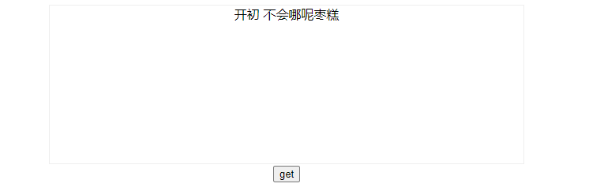

### Selection

- `Selection` 对象表示用户选择的文本范围或插入符号的当前位置。它代表页面中的文本选区，可能横跨多个元素。文本选区由用户拖拽鼠标经过文字而产生。要获取用于检查或修改的 Selection 对象，请调用 `window.getSelection()`。

- 一般来说，插入光标的位置可通过 Selection 获取，这时它被标记为 `Collapsed`，这表示选区被压缩至一点，即光标位置。

- 用户可能从左到右（与文档方向相同）选择文本或从右到左（与文档方向相反）选择文本。`anchor` 指向用户开始选择的地方，而 `focus` 指向用户结束选择的地方。如果你使用鼠标选择文本的话，anchor 就指向你按下鼠标键的地方，而 focus 就指向你松开鼠标键的地方。

- Selection 对象所对应的是用户所选择的 `ranges`（区域）。

- 更多属性和方法请参照[Selection](https://developer.mozilla.org/zh-CN/docs/Web/API/Selection)

- 我们可以这样使用这个函数：

  ```js
  // 情景：鼠标右滑选中两个字
  // 一个 Selection 对象表示用户选择的 Range 的集合。通常，它只包含一个区域，访问方式如下：
  // 调用 Selection.toString() 方法返回包含在选区内的文本
  var selObj = window.getSelection(); // selObj 是一个 Selection 对象
  var range  = selObj.getRangeAt(0); // range 是一个 Range 对象
  console.log("selObj:", selObj);
  console.log("range:", range);
  ```

  

- **使用示例**：

  ```html
  <body>
      <div id="sel" class="sel" contenteditable="true">开初不会哪呢枣糕</div>
      <button id="get_btn">get</button>
      <script>
        var sel = document.getElementById("sel");
        var get_btn = document.getElementById("get_btn");
        get_btn.onclick = () => {
          var selObj = window.getSelection();
          var range = selObj.getRangeAt(0);
          console.log("selObj:", selObj);
          console.log("range:", range);
        };
      </script>
    </body>
  ```

  页面如图：

  

  接下来用鼠标选中**开初不会**这一段区域：

                                                                                                                                            

  点击get按钮：

  

  选中区域为0~4

  若直接将鼠标置于**会**字之后：

  

  

  `anchorOffset`和`focusOffset`都为4（选区被压缩至一点，即光标位置），所以鼠标光标在4的位置。

  现调整文档结构如下：

  ```html
  <body>
      <div id="sel" class="sel" contenteditable="true">
        <!-- 此处将 开初 两个字用span标签包裹起来 -->
        <span>开初</span>
        不会哪呢枣糕
      </div>
      <button id="get_btn">get</button>
      <script>
        var sel = document.getElementById("sel");
        var get_btn = document.getElementById("get_btn");
        get_btn.onclick = () => {
          var selObj = window.getSelection();
          var range = selObj.getRangeAt(0);
          console.log("selObj:", selObj);
          console.log("range:", range);
        };
      </script>
    </body>
  ```

  

  此处 `开初` 与 后面的文字中间有一个空格是因为html文档中`<span>开初</span>`与后面的`不会哪呢枣糕`换行了。

  此时选中`开初`两字打印显示选中区域为0~2没有问题。

  但若选中`不会`两字则会打印如下：

  

  

  显示选中区域为7~9

  这是怎么回事呢？

  个人猜测是由于 `选区起点所在的节点`发生了变化。具体请详读`anchorNode`、`anchorOffset`、`focusNode`、`focusOffset`属性。

  现在将鼠标光标移至`不`字之前，打印如下：

  

  

  发现鼠标光标位置为 1，说明此时`<span>开初</span>`被视为一个整体，所以将鼠标光标移至`不`字之前时光标的偏移量为 1。

  此时再看MDN上对`anchorOffset`属性的解释就好理解一些了：

  `anchorOffset`

  返回一个数字，其表示的是选区起点在 `anchorNode` 中的位置偏移量。

  1. 如果 `anchorNode` 是文本节点，那么返回的就是从该文字节点的第一个字开始，直到被选中的第一个字之间的字数（如果第一个字就被选中，那么偏移量为零）。
  2. 如果 `anchorNode` 是一个元素，那么返回的就是在**选区第一个节点之前的同级节点总数**。(这些节点都是 `anchorNode` 的子节点)

  **验证**--选中`开初 不会哪`，打印如下：

  

  

  展开`anchorNode`和`focusNode`如下：

   
  
  这说明`开初`和`不会哪呢枣糕`已属于两个node。
  
  至于`focusOffset`为什么是 10
  
  
  
  这是由于`不会哪呢枣糕`之前的空格造成的
  
  
  
  html中审查元素也可看见
  
  