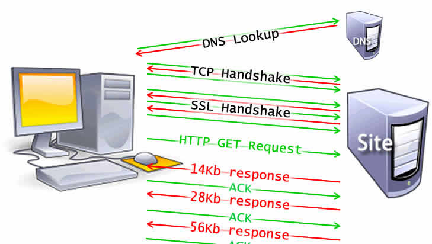
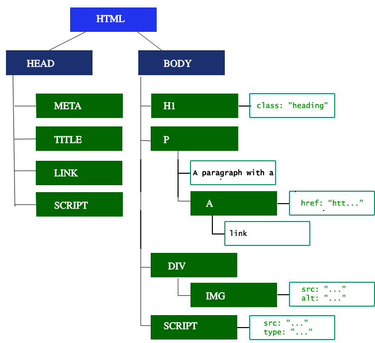

## 概述

- 快速响应的网站提供更好的用户体验。用户期待内容快速加载和交互流畅的Web体验。
- **等待资源加载时间**和大部分情况下的**浏览器单线程执行**是影响Web性能的两大主要原因。
- 等待时间是需要去克服来让浏览器快速加载资源的主要威胁，为了实现快速加载，开发者的目标就是尽可能快的发送请求的信息。网络等待时间是在链路上传送二进制到电脑端所消耗的链路传输时间。 Web性能优化需要做的就是尽可能快的使页面加载完成。
- 大部分情况下，浏览器是单线程执行的。为了有流畅的交互 ，开发者的目标是确保网站从流畅的页面滚动到点击响应的交互性能。渲染时间是关键要素，确保主线程可以完成所有给它的任务并且仍然一直可以处理用户的交互。通过了解浏览器单线程的本质与最小化主线程的责任可以优化Web性能，来确保渲染的流畅和交互响应的及时。

## 导航

- 导航是加载web页面的第一步。它发生在以下情形：用户通过在地址栏输入一个URL、点击一个链接、提交表单或者是其他的行为。
- web性能优化的目标之一就是缩短导航完成所花费的时间，在理想情况下，它通常不会花费太多的时间，但是等待资源加载时间和带宽会导致它的延时。

## DNS查找

1. 对于一个web页面来说导航的第一步是要去**寻找页面资源的位置**。如果导航到`https://example.com`, HTML页面 被定为到IP地址为 `93.184.216.34` 的服务器。如果以前没有访问过这个网站，就需要进行DNS查找。

2. **浏览器通过服务器名称（域名）请求DNS进行查找，最终返回一个IP地址**，第一次初始化请求之后，这个IP地址可能会被缓存一段时间，这样可以通过从缓存里面检索IP地址而不是再通过域名服务器进行查找来加速后续的请求。

3. 通过主机名加载一个页面通常仅需要DNS查找一次。但是DNS需要对不同的页面指向的主机名进行查找。如果fonts, images, scripts, ads, and metrics 都不同的主机名，DNS会对每一个进行查找。

   

4. DNS查找对于性能来说是一个问题，特别是对于移动网络。当一个用户用的是移动网络，每一个DNS查找必须从手机发送到信号塔，然后到达一个认证DNS服务器。手机、信号塔、域名服务器之间的距离可能是一个大的时间等待。

## TCP HandShake

- 一旦获取到服务器IP地址，浏览器就会通过TCP”三次握手“与服务器建立连接。这个机制是用来让两端尝试进行通信—浏览器和服务器在发送数据之前，通过上层协议Https可以协商网络TCP套接字连接的一些参数。
- TCP的”三次握手“技术经常被称为”SYN-SYN-ACK“—更确切的说是 SYN, SYN-ACK, ACK—因为通过TCP首先发送了三个消息进行协商，开始一个TCP会话在两台电脑之间。 是的，这意味着每台服务器之间还要来回发送三条消息，而请求尚未发出。

## TLS 协商

- 为了在HTTPS上建立安全连接，另一种握手是必须的。更确切的说是TLS协商 ，它决定了什么密码将会被用来加密通信，验证服务器，在进行真实的数据传输之前建立安全连接。在发送真正的请求内容之前还需要三次往返服务器。

  

- 虽然建立安全连接对增加了加载页面的等待时间，对于建立一个安全的连接来说，以增加等待时间为代价是值得的，因为在浏览器和web服务器之间传输的数据不可以被第三方解密。
- 经过8次往返，浏览器终于可以发出请求。

## 响应

- 一旦我们建立了到web服务器的连接，浏览器就代表用户发送一个初始的HTTP GET请求，对于网站来说，这个请求通常是一个HTML文件。 一旦服务器收到请求，它将使用相关的响应头和HTML的内容进行回复。

- ```html
  <!doctype HTML>
  <html>
   <head>
    <meta charset="UTF-8"/>
    <title>My simple page</title>
    <link rel="stylesheet" src="styles.css"/>
    <script src="myscript.js"></script>
  </head>
  <body>
    <h1 class="heading">My Page</h1>
    <p>A paragraph with a <a href="https://example.com/about">link</a></p>
    <div>
      
    </div>
    <script src="anotherscript.js"></script>
  </body>
  </html>
  ```

- 上面的例子中，这个请求肯定是小于14kb的，但是直到浏览器在解析阶段遇到链接时才会去请求链接的资源，下面有进行描述。

## TCP 慢开始 / 14kb 规则

- 第一个响应包是14kb大小。这是慢开始的一部分，慢开始是一种均衡网络连接速度的算法。慢开始逐渐增加发送数据的数量直到达到网络的最大带宽。

- 在"TCP slow start"中，在收到初始包之后, 服务器会将下一个包的大小加倍到大约28kb。 后续的包依次是前一个包大小的二倍直到达到预定的阈值，或者遇到拥塞。

  

- 如果您听说过初始页面加载的14Kb规则，TCP慢开始就是初始响应为14Kb的原因，也是为什么web性能优化需要将此初始14Kb响应作为优化重点的原因。TCP慢开始逐渐建立适合网络能力的传输速度，以避免拥塞。

## 拥塞控制

- 当服务器用TCP包来发送数据时，客户端通过返回确认帧来确认传输。由于硬件和网络条件，连接的容量是有限的。 如果服务器太快地发送太多的包，它们可能会被丢弃。意味着，将不会有确认帧的返回。服务器把它们当做确认帧丢失。拥塞控制算法使用这个发送包和确认帧流来确定发送速率。

## 解析

- 一旦浏览器收到数据的第一块，它就可以开始解析收到的信息。“推测性解析”，“解析”是浏览器将通过网络接收的数据转换为DOM和CSSOM的步骤，通过渲染器把DOM和CSSOM在屏幕上绘制成页面。
- 即使请求页面的HTML大于初始的14KB数据包，浏览器也将开始解析并尝试根据其拥有的数据进行渲染。这就是为什么在前14Kb中包含浏览器开始渲染页面所需的所有内容，或者至少包含页面模板（第一次渲染所需的CSS和HTML）对于web性能优化来说是重要的。但是在渲染到屏幕上面之前，HTML、CSS、JavaScript必须被解析完成。

## 构建DOM树

1. 第一步是处理HTML标记并构造DOM树。HTML解析涉及到 [tokenization](https://developer.mozilla.org/en-US/docs/Web/API/DOMTokenList) 和树的构造。HTML标记包括开始和结束标记，以及属性名和值。 如果文档格式良好，则解析它会简单而快速。解析器将标记化的输入解析到文档中，构建文档树。

2. DOM树描述了文档的内容。<html>元素是第一个标签也是文档树的根节点。树反映了不同标记之间的关系和层次结构。嵌套在其他标记中的标记是子节点。DOM节点的数量越多，构建DOM树所需的时间就越长。

   

## 预加载扫描器

- 浏览器构建DOM树时，这个过程占用了主线程。当这种情况发生时，预加载扫描仪将解析可用的内容并请求高优先级资源，如CSS、JavaScript和web字体。多亏了预加载扫描器，我们不必等到解析器找到对外部资源的引用来请求它。它将在后台检索资源，以便在主HTML解析器到达请求的资源时，它们可能已经在运行，或者已经被下载。预加载扫描仪提供的优化减少了阻塞。

- ```html
  <link rel="stylesheet" src="styles.css"/>
  <script src="myscript.js" async></script>
  
  <script src="anotherscript.js" async></script>
  ```

  在这个例子中，当主线程在解析HTML和CSS时，预加载扫描器将找到脚本和图像，并开始下载它们。为了确保脚本不会阻塞进程，当JavaScript解析和执行顺序不重要时，可以添加async属性或defer属性。

- 等待获取CSS不会阻塞HTML的解析或者下载，但是它的确阻塞JavaScript，因为JavaScript经常用于查询元素的CSS属性。

## 构建CSSOM树

1. 第二步是处理CSS并构建CSSOM树。CSS对象模型和DOM是相似的。DOM和CSSOM是两棵树. 它们是独立的数据结构。浏览器将CSS规则转换为可以理解和使用的样式映射。浏览器遍历CSS中的每个规则集，根据CSS选择器创建具有父、子和兄弟关系的节点树。
2. CSSOM树包括来自用户代理样式表的样式。浏览器从适用于节点的最通用规则开始，并通过应用更具体的规则递归地优化计算的样式。
3. 构建CSSOM非常非常快，并且在当前的开发工具中没有以独特的颜色显示。相反，开发人员工具中的“重新计算样式”显示解析CSS、构造CSSOM树和递归计算计算样式所需的总时间。在web性能优化方面，它是可轻易实现的，因为创建CSSOM的总时间通常小于一次DNS查找所需的时间。

## 其他过程

## JavaScript 编译

- 当CSS被解析并创建CSSOM时，其他资源，包括JavaScript文件正在下载（多亏了preload scanner）。JavaScript被解释、编译、解析和执行。脚本被解析为抽象语法树。一些浏览器引擎使用”Abstract Syntax Tree“并将其传递到解释器中，输出在主线程上执行的字节码。这就是所谓的JavaScript编译。

## 构造辅助功能树

- 浏览器还构建辅助设备用于分析和解释内容的辅助功能（[accessibility](https://developer.mozilla.org/en-US/docs/Learn/Accessibility) ）树。可访问性对象模型（AOM）类似于DOM的语义版本。当DOM更新时，浏览器会更新辅助功能树。辅助技术本身无法修改可访问性树。
- 在构建AOM之前，屏幕阅读器（[screen readers](https://developer.mozilla.org/en-US/docs/Web/Accessibility/ARIA/ARIA_Screen_Reader_Implementors_Guide)）无法访问内容。

## 渲染

- 渲染步骤包括样式、布局、绘制，在某些情况下还包括合成。在解析步骤中创建的CSSOM树和DOM树组合成一个**Render树**，然后用于计算每个可见元素的布局，然后将其绘制到屏幕上。在某些情况下，可以将内容提升到它们自己的层并进行合成，通过在GPU而不是CPU上绘制屏幕的一部分来提高性能，从而释放主线程。

## Style

- 第三步是将DOM和CSSOM组合成一个Render（渲染）树，计算样式树或渲染树从DOM树的根开始构建，遍历每个可见节点。
- 像<head>和它的子节点以及任何具有`display: none`样式的结点，例如`script { display: none; }`（在user agent stylesheets可以看到这个样式）这些标签将不会显示，也就是它们不会出现在Render树上。具有`visibility: hidden`的节点会出现在Render树上，因为它们会占用空间。由于我们没有给出任何指令来覆盖用户代理默认值，因此上面代码示例中的script节点将不会包含在Render树中。
- 每个可见节点都应用了其CSSOM规则。Render树保存所有具有内容和计算样式的可见节点——将所有相关样式匹配到DOM树中的每个可见节点，并根据CSS级联确定每个节点的计算样式。

## Layout

- 第四步是在渲染树上运行布局以计算每个节点的几何体。布局是确定呈现树中所有节点的宽度、高度和位置，以及确定页面上每个对象的大小和位置的过程。回流是对页面的任何部分或整个文档的任何后续大小和位置的确定。
- 构建渲染树后，开始布局。渲染树标识显示哪些节点（即使不可见）及其计算样式，但不标识每个节点的尺寸或位置。为了确定每个对象的确切大小和位置，浏览器从渲染树的根开始遍历它。
- 在网页上，大多数东西都是一个盒子。不同的设备和不同的桌面意味着无限数量的不同的视区大小。在此阶段，考虑到视区大小，浏览器将确定屏幕上所有不同框的尺寸。以视区的大小为基础，布局通常从body开始，用每个元素的框模型属性排列所有body的子孙元素的尺寸，为不知道其尺寸的替换元素（例如图像）提供占位符空间。
- 第一次确定节点的大小和位置称为布局。随后对节点大小和位置的重新计算称为回流。在我们的示例中，假设初始布局发生在返回图像之前。由于我们没有声明图像的大小，因此一旦知道图像大小，就会有回流。

## Paint

- 最后一步是将各个节点绘制到屏幕上，第一次出现的节点称为[first meaningful paint](https://developer.mozilla.org/en-US/docs/Glossary/first_meaningful_paint)。在绘制或光栅化阶段，浏览器将在布局阶段计算的每个框转换为屏幕上的实际像素。绘画包括将元素的每个可视部分绘制到屏幕上，包括文本、颜色、边框、阴影和替换的元素（如按钮和图像）。浏览器需要非常快地完成这项工作。
- 为了确保平滑滚动和动画。占据主线程的所有的内容：包括计算样式，以及回流和绘制，必须让浏览器在16.67毫秒内完成。在2048x 1536，iPad有超过314.5万像素将被绘制到屏幕上。那是很多像素需要快速绘制。为了确保重绘的速度比初始绘制的速度更快，屏幕上的绘图通常被分解成数层。如果发生这种情况，则需要进行合成。
- 绘制可以将布局树中的元素分解为多个层。将内容提升到GPU上的层（而不是CPU上的主线程）可以提高绘制和重新绘制性能。有一些特定的属性和元素可以实例化一个层，包括<video>和<canvas>，任何CSS属性为opacity、3D转换、`will-change`的元素，还有一些其他元素。这些节点将与子节点一起绘制到它们自己的层上，除非子节点由于上述一个（或多个）原因需要自己的层。
- 层确实可以提高性能，但是它以内存管理为代价，因此不应作为web性能优化策略的一部分过度使用。

## Compositing

- 当文档的各个部分以不同的层绘制，相互重叠时，必须进行合成，以确保它们以正确的顺序绘制到屏幕上，并正确显示内容。
- 当页面继续加载资产时，可能会发生回流（回想一下我们迟到的示例图像），回流会触发重新绘制和重新组合。如果我们定义了图像的大小，就不需要重新绘制，只需要重新绘制需要重新绘制的层，并在必要时进行合成。但我们没有包括图像大小！从服务器获取图像后，渲染过程将返回到布局步骤并从那里重新开始。

