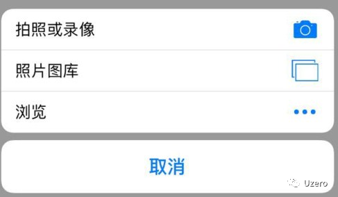
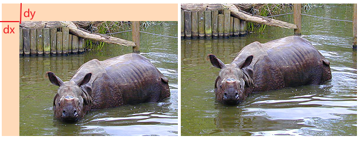
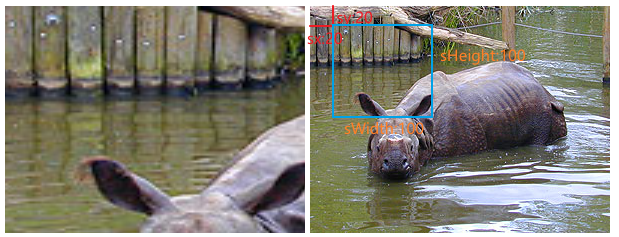

## 图片上传

### 步骤

选择图片 -> 预览图片 -> [裁剪图片]  -> 图片压缩 -> 上传图片

### 选择图片

选择图片有什么好讲的呢？不就一个 `input[type=file]` ，然后点击就可以了吗？确实是这样的，但是，我们想要做得更加的友好一些，比如需要过滤掉非图片文件， 或只允许从摄像头拍照获取图片等，还是需要进行一些简单配置的。

先来看看最简单的选择图片

```html
<input type="file" />
<!--或者选择多张图片-->
<!--<input type="file" multiple />-->
```

这时候，点击这个 input , 在 iOS 手机的显示如下：



其中的 “浏览” 选项，可以查看到非图片类型的文件，这并不是我们想要的结果，毕竟我们只想要图片类型。可以通过 `accept` 属性来实现，如下：

```html
<input type="file" accept="image/*">
```

这样就可以过滤掉非图片类型了。但是图片的类型可能也太多了， 有些可能服务器不支持，所以，如果想保守一些，只允许 `jpg` 和 `png` 类型，可以写成这样：

```html
<input type="file" accept="image/jpg, image/jpeg, image/png">
```

或者：

```html
<input type="file" accept=".jpg, .jpeg, .png">
```

OK, 过滤非图片的需求搞定了。但是有时候 ，产品还要求只能从摄像头采集图片，比如需要上传证件照，防止从网上随便找别人的证件上传，那`capture` 属性就可以派上用场了：

```html
<input type="file" accept="image/*" capture>
```

这时候，就不能从文件系统中选择照片了，只能从摄像头采集。到了这一步，可能觉得很完美了，但是还有个问题，可能有些变态产品要求默认打开前置摄像头采集图片，比如就是想要你的自拍照片。`capture` 默认调用的是后置摄像头。默认启用前置摄像头可以设置 `capture="user"` ，如下：

```html
<input type="file" accept="image/*" capture="user">
```

好啦，关于选择图片的就讲么这么多了，有个注意的地方是，可能有些配置在兼容性上会有一些问题，所以需要在不同的机型上测试一下看看效果。

下面再来谈谈预览图片的实现。

### 预览图片

在远古时代，前端并没有预览图片的方法。当时的做法是，用户选择图片之后，立刻把图片上传到服务器，然后服务器返回远程图片的 url 给前端显示。这种方法略显麻烦，而且会浪费用户的流量，因为用户可能还没有确定要上传，你却已经上传了。幸好，远古时代已经离我们远去了，现代浏览器已经实现了前端预览图片的功能。常用的方法有两个，分别是 `URL.createObjectURL()` 和 `FileReader` 。

1. ### **使用 URL.createObjectURL**

   **`URL.createObjectURL()`** 静态方法会创建一个 [`DOMString`](https://developer.mozilla.org/zh-CN/docs/Web/API/DOMString)，其中包含一个表示参数中给出的对象的URL。这个 URL 的生命周期和创建它的窗口中的 [`document`](https://developer.mozilla.org/zh-CN/docs/Web/API/Document) 绑定。这个新的URL 对象表示指定的 [`File`](https://developer.mozilla.org/zh-CN/docs/Web/API/File) 对象或 [`Blob`](https://developer.mozilla.org/zh-CN/docs/Web/API/Blob) 对象。

   语法：objectURL = URL.createObjectURL(object)

   参数：

   - **object**：用于创建 URL 的 [`File`](https://developer.mozilla.org/zh-CN/docs/Web/API/File) 对象、[`Blob`](https://developer.mozilla.org/zh-CN/docs/Web/API/Blob) 对象或者 [`MediaSource`](https://developer.mozilla.org/zh-CN/docs/Web/API/MediaSource) 对象。

   返回值：

   - 一个[`DOMString`](https://developer.mozilla.org/zh-CN/docs/Web/API/DOMString)包含了一个对象URL，该URL可用于指定源 `object`的内容。

   内存管理：

   - 在每次调用 `createObjectURL()` 方法时，都会创建一个新的 URL 对象，即使你已经用相同的对象作为参数创建过。当不再需要这些 URL 对象时，每个对象必须通过调用 [`URL.revokeObjectURL()`](https://developer.mozilla.org/zh-CN/docs/Web/API/URL/revokeObjectURL) 方法来释放。
   - 浏览器在 document 卸载的时候，会自动释放它们，但是为了获得最佳性能和内存使用状况，你应该在安全的时机主动释放掉它们。
   
   使用案例：
   
   ```html
   <body>
       <div class="c">
         <input type="file" id="choose" accept="image/*" />
         <p>
           
         </p>
       </div>
       <script>
         const fileChooser = document.getElementById('choose')
         const urlObj = document.querySelector('.url__obj')
   
         fileChooser.onchange = function (event) {
           // 两种方法都能取到图片的file对象
           console.log('event-files:', event.target.files)
           console.log('this-files:', this.files)
           const objURL = URL.createObjectURL(this.files[0])
           console.log('objURL:', objURL) // 返回的URL类似这种：blob:http://127.0.0.1:5500/ff255b53-2472-4139-a105-ee79fb8b5d25
           urlObj.src = objURL
         }
       </script>
   </body>
   ```
   
2. **使用FileReader**

   FileReader：

   - `**FileReader**` 对象允许Web应用程序异步读取存储在用户计算机上的文件（或原始数据缓冲区）的内容，使用 [`File`](https://developer.mozilla.org/zh-CN/docs/Web/API/File) 或 [`Blob`](https://developer.mozilla.org/zh-CN/docs/Web/API/Blob) 对象指定要读取的文件或数据。
   - 其中File对象可以是来自用户在一个[``](https://developer.mozilla.org/zh-CN/docs/Web/HTML/Element/Input)元素上选择文件后返回的[`FileList`](https://developer.mozilla.org/zh-CN/docs/Web/API/FileList)对象,也可以来自拖放操作生成的 [`DataTransfer`](https://developer.mozilla.org/zh-CN/docs/Web/API/DataTransfer)对象,还可以是来自在一个[`HTMLCanvasElement`](https://developer.mozilla.org/zh-CN/docs/Web/API/HTMLCanvasElement)上执行`mozGetAsFile()`方法后返回结果。还有`File` 对象是特殊类型的 [`Blob`](https://developer.mozilla.org/zh-CN/docs/Web/API/Blob)，可以用在任意的 Blob 类型的 context 中。
   - 注意：FileReader仅用于以安全的方式从用户（远程）系统读取文件内容 它不能用于从文件系统中按路径名简单地读取文件。 要在JavaScript中按路径名读取文件，应使用标准Ajax解决方案进行服务器端文件读取，如果读取跨域，则使用CORS权限。

   使用案例：

   ```html
   <body>
       <div class="c">
         <input type="file" id="choose" accept="image/*" />
         <p>
           
         </p>
       </div>
       <script>
         const fileChooser = document.getElementById('choose')
         const urlFilerd = document.querySelector('.url__filerd')
   
         fileChooser.onchange = function (event) {
            // 两种方法都能取到图片的file对象
           console.log('event-files:', event.target.files)
           console.log('this-files:', this.files)
             
           const reader = new FileReader()
           reader.onload = function (event) {
             // this.result就是图片的Base64地址啦
             urlFilerd.src = this.result
             // 当然，也可通过event.target.result获取到图片Base64地址
             // urlFilerd.src = event.target.result
           }
           // 开始读取指定的Blob中的内容。一旦完成，result属性中将包含一个data: URL格式的Base64字符串以表示所读取文件的内容。
           reader.readAsDataURL(this.files[0])
         }
       </script>
</body>
   ```

   **两种方法的对比**：
   
   `URL.createObjectURL()` API 简洁，同步读取，并且返回的是一个 `URL` ，比 `FileReaer` 返回的base64 更加精简。兼容性上，两者都差不多，都是在 `WD` 的阶段。性能上的对比, 在 chrome 上, 选择了一张 2M 的图片, `URL.createObjectURL()` 用时是 0 , 而 `FileReader` 用时 20ms 左右。0 感觉不太合理，虽然这个方法立刻就会返回一个 URL ，但是我猜测实际上这个 URL 指定的内容还没有生成好，应该是异步生成的，然后才渲染出来的。所以暂时没想到很好的办法来对比他们的性能。

### 图片裁剪

待后面补充。。。

### 图片压缩上传

前置知识点：CanvasRenderingContext2D.drawImage()

Canvas 2D API 中的 `CanvasRenderingContext2D.drawImage()` 方法提供了多种方式在Canvas上绘制图像。

语法：

```js
void ctx.drawImage(image, dx, dy);
void ctx.drawImage(image, dx, dy, dWidth, dHeight);
void ctx.drawImage(image, sx, sy, sWidth, sHeight, dx, dy, dWidth, dHeight);
```

参数：

- **image**：绘制到上下文的元素。允许任何的 canvas 图像源([`CanvasImageSource`](https://developer.mozilla.org/zh-CN/docs/Web/API/CanvasImageSource))

- **sx,sy,sWidth,sHeight**（这四个参数都为**可选**参数）

  表示要用图片的哪一部分显示在`canvas`画布上。`sx,sy`表示用**图片上**`sx,sy`这个坐标所在的点作为左上角，然后往右下角的`swidth,sheight`尺寸范围图片作为最终在canvas上显示的图片内容。

- **dx, dy, dWidth, dHeight**（dx, dy为必选参数，dWidth, dHeight为**可选**参数）

  表示在`canvas`画布上规划出一片区域用来放置图片，`dx, dy`表示图片距离canvas元素左上角的距离，`dWidth, dHeight`指canvas元素上用来显示图片的区域大小。如果没有指定`sx,sy,sWidth,sHeight`这4个参数，则图片会被拉伸或缩放在这片区域内。

示例：

```html
<body>
    <canvas id="canvas" width="300" height="227"></canvas>
    <!-- 图片本身真实尺寸为300*277 -->
     
    <script>
      var canvas = document.getElementById('canvas')
      var ctx = canvas.getContext('2d')
      var image = document.getElementById('source')

      image.onload = function () {
        ctx.drawImage(image, 0, 0, 300, 227, 30, 30, 300, 227)
      }
    </script>
</body>
```

效果如下：



左边橘黄色背景元素为canvas，右边是源图。这样结合代码`ctx.drawImage(image, 0, 0, 300, 227, 30, 30, 300, 227)`和上面的理论就能明白这些参数分别代表啥了。

可能还会有人对**sx,sy,sWidth,sHeight**这四个参数有疑惑，这里将以上代码改一下，再结合展示应该就能明白了，如下：

```html
<body>
    <canvas id="canvas" width="300" height="227"></canvas>
    <!-- 图片本身真实尺寸为300*277 -->
    
    <script>
      var canvas = document.getElementById('canvas')
      var ctx = canvas.getContext('2d')
      var image = document.getElementById('source')

      image.onload = function () {
        ctx.drawImage(image, 20, 20, 100, 100, 0, 0, 300, 227)
      }
    </script>
</body>
```

效果如下：



`ctx.drawImage(image, 0, 0, 300, 227, 0, 0, 300, 227)`表示以源图左上角(sx,sy)坐标处开始，截取出一块长高为100px的矩形（即右图中蓝色方框），然后这个矩形中的图片部分即为要显示到画布中的部分。又由于**dx, dy, dWidth, dHeight**分别为0,0,300,277，所以蓝色矩形中的图片就被从画布左上角(0, 0)处开始被拉伸直至充满300*277的画布。

### 如何把canvas画布转换成img图像

`canvas`天然提供了2个转图片的方法：

1. **canvas.toDataURL()方法**

   ```js
   canvas.toDataURL(mimeType, qualityArgument)
   ```

   可以把图片转换成base64格式信息，纯字符的图片表示法。

   - `mimeType`表示`canvas`导出来的`base64`图片的类型，默认是png格式，也即是默认值是`'image/png'`，我们也可以指定为jpg格式`'image/jpeg'`或者webp等格式。`file`对象中的`file.type`就是文件的mimeType类型，在转换时候正好可以直接拿来用（如果有file对象）。
   - `qualityArgument`表示导出的图片质量，只要导出为`jpg`和`webp`格式的时候此参数才有效果，默认值是`0.92`，是一个比较合理的图片质量输出参数，通常情况下，我们无需再设定。

2. **canvas.toBlob()方法**

   ```js
   canvas.toBlob(callback, mimeType, qualityArgument)
   ```

   可以把canvas转换成[Blob文件](http://www.zhangxinxu.com/wordpress/2013/10/understand-domstring-document-formdata-blob-file-arraybuffer/)，通常用在文件上传中，因为是二进制的，对后端更加友好。

和`toDataURL()`方法相比，`toBlob()`方法是异步的，因此多了个`callback`参数，这个`callback`回调方法默认的第一个参数就是转换好的`blob`文件信息，本文demo的文件上传就是将`canvas`图片转换成二进制的`blob`文件，然后再`ajax`上传的，代码如下：

```js
// canvas转为blob并上传
canvas.toBlob(function (blob) {
  // 图片ajax上传
  var xhr = new XMLHttpRequest();
  // 开始上传
  xhr.open("POST", 'upload.php', true);
  xhr.send(blob);    
});
```


**图片压缩上传大体思路：**

1. 利用[FileReader](https://developer.mozilla.org/zh-CN/docs/Web/API/FileReader),读取`blob对象`,或者是`file对象`，将图片转化为`data uri`的形式。
2. 使用`canvas`,在页面上新建一个画布,利用`canvas`提供的API,将图片画入这个画布当中。
3. 利用`canvas.toDataURL()`，进行图片质量的压缩，得到图片的`data uri`的值。
4. 上传文件

步骤1：在进行图片压缩前，对图片大小做了个判断：如果图片大小大于200KB时，是直接进行图片上传，不进行图片的压缩，如果图片的大小是大于200KB，则是先进行图片的压缩再上传。

```html
<input type="file" id="choose" accept="image/*">
```

```js
 var fileChooser = document.getElementById("choose")
 var maxSize = 200 * 1024 //200KB
 fileChoose.change = function() {
   var file = this.files[0]   //读取文件
   var reader = new FileReader()
   reader.onload = function() {
     var result = this.result //result为data url的形式
     var img = new Image()
     img.src = result
                      
     if(result.length < maxSize) {  
       imgUpload(result) //图片直接上传
     } else {
       var data = compress(img) //图片首先进行压缩
       imgUpload(data) //图片上传
     }
   } 
   reader.readAsDataURL(file);
 }
```

步骤2，3：

```js
var canvas = document.createElement('canvas')
var ctx = canvas.getContext('2d')
        
function compress(img) {
  canvas.width = img.width
  canvas.height = img.height
        
  // 利用canvas进行绘图
  // HTMLCanvasElement.toDataURL() 方法返回一个包含图片展示的 data URI 。可以使用 type 参数其类型，默认为 PNG 格式。
  // 在指定图片格式为 image/jpeg 或 image/webp的情况下，可以从 0 到 1 的区间内选择图片的质量。如果超出取值范围，将会使用默认值 0.92。
  // 注意：使用image/png类型的话是没有第二个参数的，toDataURL第一个参数用image/png的话图片是不会压缩的，反倒会越压越大。
  var base64Url = canvas.toDataURL('image/jpeg', 0.2) //data url的形式
    
  return base64Url
}
```

步骤4,文件上传有2种方式：

1. 将图片转化为`base64`然后使用FormData直接上传
2. 将图片数据转为`Blob对象`，再使用`FormData`上传文件。

使用案例（注意：此案例与上面各个步骤的案例并无关联）：

```html
<body>
    <input type="file" id="choose" accept="image/*" />
    
    <script>
      const fileChooser = document.getElementById('choose')
      fileChooser.onchange = function (event) {
        const reader = new FileReader()
        reader.onload = function (event) {
          // this.result就是图片的Base64地址啦
          let file_base64 = this.result
          var originalSize = convertBase64UrlToBlob(file_base64).size
          console.log('original-size:', originalSize)

          // 新建一个图像对象，用来获取老图片的原始尺寸
          var img = new Image()
          img.src = file_base64
          // 在图片完成加载后继续处理后面的
          img.onload = function () {
            // 获取图片的宽高
            var img_width = this.width
            var img_height = this.height
            console.log('img_width:', img_width)
            console.log('img_height:', img_height)
            // 创建canvas，用其drawImage方法可改变图片的尺寸，用其toDataURL方法可以改变图片的质量，达到压缩的目的。
            var canvas = document.createElement('canvas')
            var ctx = canvas.getContext('2d')
            canvas.width = img_width
            canvas.height = img_height

            // 用drawImage方法将图片画在cancas上
            ctx.drawImage(this, 0, 0, img_width, img_height)
            // HTMLCanvasElement.toDataURL() 方法返回一个包含图片展示的 data URI 。可以使用 type 参数其类型，默认为 PNG 格式。
            // 在指定图片格式为 image/jpeg 或 image/webp的情况下，可以从 0 到 1 的区间内选择图片的质量。如果超出取值范围，将会使用默认值 0.92。
            // 注意：使用image/png类型的话是没有第二个参数的，toDataURL第一个参数用image/png的话图片是不会压缩的，反倒会越压越大。
            file_base64 = canvas.toDataURL('image/jpeg', 0.85)
            // 将base64塞入img标签中进行预览
            document.getElementById('preview').src = file_base64
            // 将base64转化为blob，如果图片需要上传至后台，则需要这一步，然后再利用FormData进行上传。
            var blob = convertBase64UrlToBlob(file_base64)
            const finalSize = blob.size
            console.log('final-size:', blob.size)
            // 计算图片压缩比 console.log('原大小：'+size); console.log('现大小：'+blob.size);
            var rate = ((finalSize / originalSize) * 100).toFixed(2)
            console.log('压缩率：' + rate + '%')
          }
        }
        // 开始读取指定的Blob中的内容。一旦完成，result属性中将包含一个data: URL格式的Base64字符串以表示所读取文件的内容。
        reader.readAsDataURL(this.files[0])
      }

      // 将base64转化为blob
      function convertBase64UrlToBlob(urlData) {
        var arr = urlData.split(','),
          mime = arr[0].match(/:(.*?);/)[1],
          bstr = atob(arr[1]),
          n = bstr.length,
          u8arr = new Uint8Array(n)
        while (n--) {
          u8arr[n] = bstr.charCodeAt(n)
        }
        return new Blob([u8arr], { type: mime })
      }
    </script>
</body>
```

在这个案例中，只进行了图片质量的压缩，并未对图片尺寸做压缩。

在下面这个案例中，还对图片尺寸进行了压缩，并且加入了图片大小判断（超过限制尺寸才压缩）、图片最大尺寸限制等功能。

##### HTML代码：

```html
<input id="file" type="file">
```

##### JS代码：

```js
var eleFile = document.querySelector('#file');

// 压缩图片需要的一些元素和对象
var reader = new FileReader(), img = new Image();

// 选择的文件对象
var file = null;

// 缩放图片需要的canvas
var canvas = document.createElement('canvas');
var context = canvas.getContext('2d');

// base64地址图片加载完毕后
img.onload = function () {
    // 图片原始尺寸
    var originWidth = this.width;
    var originHeight = this.height;
    // 最大尺寸限制
    var maxWidth = 400, maxHeight = 400;
    // 目标尺寸
    var targetWidth = originWidth, targetHeight = originHeight;
    // 图片尺寸超过400x400的限制
    if (originWidth > maxWidth || originHeight > maxHeight) {
        if (originWidth / originHeight > maxWidth / maxHeight) {
            // 更宽，按照宽度限定尺寸
            targetWidth = maxWidth;
            targetHeight = Math.round(maxWidth * (originHeight / originWidth));
        } else {
            targetHeight = maxHeight;
            targetWidth = Math.round(maxHeight * (originWidth / originHeight));
        }
    }
        
    // canvas对图片进行缩放
    canvas.width = targetWidth;
    canvas.height = targetHeight;
    // 清除画布
    context.clearRect(0, 0, targetWidth, targetHeight);
    // 图片压缩
    context.drawImage(img, 0, 0, targetWidth, targetHeight);
    // canvas转为blob并上传
    canvas.toBlob(function (blob) {
        // 图片ajax上传
        var xhr = new XMLHttpRequest();
        // 文件上传成功
        xhr.onreadystatechange = function() {
            if (xhr.status == 200) {
                // xhr.responseText就是返回的数据
            }
        };
        // 开始上传
        xhr.open("POST", 'upload.php', true);
        xhr.send(blob);    
    }, file.type || 'image/png');
};

// 文件base64化，以便获知图片原始尺寸
reader.onload = function(e) {
    img.src = e.target.result;
};
eleFile.addEventListener('change', function (event) {
    file = event.target.files[0];
    // 选择的文件是图片
    if (file.type.indexOf("image") == 0) {
        reader.readAsDataURL(file);    
    }
});
```

在实际项目中，图片尺寸压缩和图片质量压缩可以同时进行，这里分开写只是为了看代码更清晰一点。

#### 关于图片/文件上传更多信息，可以参考[MDN这个章节](https://developer.mozilla.org/zh-CN/docs/Web/API/File/Using_files_from_web_applications#example.3a_using_object_urls_to_display_images)!!!

