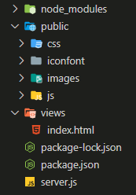

1. 初始化项目

   创建项目`smartlive`，进入文件夹，初始化项目

   ```shell
   npm init -y
   ```

   生成`package.json`

   ```json
   {
     "name": "smartlive",
     "version": "1.0.0",
     "description": "",
     "main": "index.js",
     "scripts": {
       "test": "echo \"Error: no test specified\" && exit 1"
     },
     "keywords": [],
     "author": "",
     "license": "ISC"
   }
   ```

   更改入口文件：将`"main": "index.js"`改为`"main": "server.js"`

   在项目根目录创建`server.js`

2. 安装express

   ```she
   npm install express --save
   ```

   搭建express服务器

   `server.js`

   ```js
   const express = require('express')
   const app = express()
   
   app.get('/', (req, res) => {
     res.end(req.url);
   })
   
   app.listen(3000, () => {
     console.log('服务器正运行在127.0.0.1:3000上...')
   })
   ```

   此时访问`127.0.0.1:3000`便可看见网页上打印出了 `/`，说明一个express服务器搭建成功。

3. 为了服务器能监视文件的变化，当文件发生变化的时候，自动帮助我们重启服务器（不用每次修改了文件都要`ctrl+c`退出然后再`node server.js`重启服务器）。可以使用一个第三方工具--`nodemon`。

   ```she
   npm install -g nodemon #全局安装
   ```

   然后重启`VSCode`后便可通过`nodemon app.js`命令启动服务，以后每当我们修改了`js`文件按下保存时，它会自动帮助你重启服务器。

4. 创建一个托管静态资源的文件夹-public

   首先再项目根目录下创建一个`public`文件夹，然后

   `server.js`

   ```js
   const express = require('express')
   const path = require('path')
   
   const app = express()
   
   // 创建一个托管静态资源的文件夹public
   app.use('/public', express.static(path.join(__dirname, 'public')))
   
   app.get('/', (req, res) => {
     res.end(req.url);
   })
   
   app.listen(3001, () => {
     console.log('服务器正运行在127.0.0.1:3001上...')
   })
   ```

   现在往`public`文件夹中放入一个`reset.css`文件，然后通过`http://127.0.0.1:3001/public/reset.css`便可访问到`reset.css`文件了。

   如果在创建托管静态资源的文件夹时第一个参数`/public`不写，则可直接通过根目录`http://127.0.0.1:3001/reset.css`访问到`reset.css`文件。

   现在在`public`文件夹中创建`js`，`css`，`images`等等文件夹存放相应的文件，并可通过以上方式直接访问到。

5. 项目使用`art-template`作为模板引擎

   安装`art-template`：

   ```shell
   npm install --save art-template
   npm install --save express-art-template
   ```

   使用示例（具体可参照官网）：

   ```js
   var express = require('express');
   var app = express();
   
   // view engine setup
   app.engine('art', require('express-art-template'));
   app.set('view options', {
       debug: process.env.NODE_ENV !== 'production'
   });
   app.set('views', path.join(__dirname, 'views'));
   app.set('view engine', 'art');
   
   // routes
   app.get('/', function (req, res) {
       res.render('index.art', {
           user: {
               name: 'aui',
               tags: ['art', 'template', 'nodejs']
           }
       });
   });
   ```

   我的实际配置：

   ```js
   // view engine setup
   // 这是关键的代码，第一个参数表示将使用模板引擎文件的后缀名，可以将art改为html,使用模板引擎的文件的后缀名也就需要是html
   app.engine('html', require('express-art-template'))
   app.set('views', path.join(__dirname, 'views'))
   app.set('view engine', 'art')
   ```

   由于`art-template`默认会去`views`文件夹里找页面文件，于是在根目录下创建一个`views`文件夹存放页面文件（`html`）。

6. 现在在`views`文件夹中创建一个`index.html`文件作为网站首页。当用户访问`http://127.0.0.1:3001/`时服务器返回`index.html`给浏览器。

   ```html
   <!DOCTYPE html>
   <html lang="en">
     <head>
       <meta charset="UTF-8" />
       <meta name="viewport" content="width=device-width, initial-scale=1.0" />
       <title>首页</title>
     </head>
     <body>
       <h1>首页</h1>
       <div>用户名：{{user.uname}}</div>
       <ul>
         {{each vBgImgList}}
         <li>
           
         </li>
         {{/each}}
       </ul>
     </body>
   </html>
   ```

   

7. 创建页面首页路由

   `server.js`

   ```js
   const express = require('express')
   const path = require('path')
   
   const app = express()
   
   // 创建一个托管静态资源的文件夹public
   app.use('/public', express.static(path.join(__dirname, 'public')))
   
   app.engine('html', require('express-art-template'))
   app.set('views', path.join(__dirname, 'views'))
   app.set('view engine', 'art')
   
   app.get('/', (req, res) => {
     // 要在首页上渲染的数据
     tlData = {
       user: { uname: 'art' },
       vBgImgList: [
         {
           id: 0,
           url: 'https://livewebbs2.msstatic.com/live_1600238369.jpg',
         }
       ],
       ...
     }
     // 把数据渲染到页面并返回index.html到浏览器
     res.render('index.html', tlData)
   })
   
   app.listen(3001, () => {
     console.log('服务器正运行在127.0.0.1:3001上...')
   })
   ```

   此时在浏览地址栏输入`http://127.0.0.1:3001/`即可访问网站首页。

   至此，一个基于`nodejs`服务端渲染的网站项目的雏形已搭建好了。

   此时的项目结构为：

   
   
   此项目使用`MogoDB`作为后台数据库，下一节将介绍如何安装以及使用`MogoDB`。