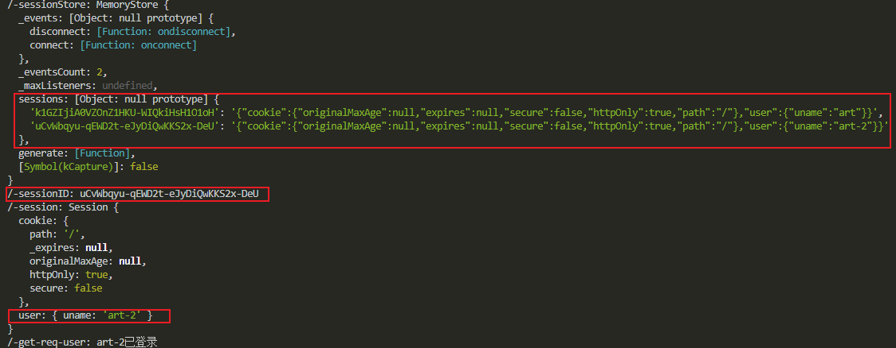

### Register

1. 创建注册路由

   method：POST

   params：uname、pwd

   为了能处理POST请求请求体中的数据，需要安装一个第三方库`body-parser`：

   安装：
   
   ```she
   npm install body-parser --save
   ```
   
   配置：
   
   `server.js`
   
   ```js
   app.use(bodyParser.urlencoded({ extended: false }))
   app.use(bodyParser.json())
   ```
   
   `server.js`
   
   ```js
   const express = require('express')
   const path = require('path')
   const bodyParser = require('body-parser')
   const mongodb = require('mongodb')
   
   let mongodbClient = null
   function dbConnect() {
     return new Promise((resolve, reject) => {
       const url = 'mongodb://localhost:27017/art-test-db'
       mongodb.MongoClient.connect(url, { useNewUrlParser: true }, (err, client) => {
         if (err) {
           console.error('Error connecting to the MongoDB URL: ' + url)
           reject(err)
         } else {
           console.log("数据库连接成功...");
        	mongodbClient = client
           let db = mongodbClient.db('art-test-db')
           // Make sure connection closes when Node exits
           process.on('exit', (code) => {
             dbClose()
           })
           resolve(db)
         }
       })
     })
   }
   function dbClose() {
     if (mongodbClient && mongodbClient.isConnected()) {
       mongodbClient.close()
     }
   }
   
   const app = express()
   
   app.use('/public', express.static(path.join(__dirname, 'public')))
   app.use('/layout', express.static(path.join(__dirname, 'layout')))
   
   app.use(bodyParser.urlencoded({ extended: false }))
   app.use(bodyParser.json())
   
   // view engine setup
   // 这是关键的代码，第一个参数表示将使用模板引擎文件的后缀名，可以将art改为html,使用模板引擎的文件的后缀名也就需要是html
   app.engine('html', require('express-art-template'))
   app.set('views', path.join(__dirname, 'views'))
   app.set('view engine', 'art')
   
   app.get('/', (req, res) => {
     // 要在首页上渲染的数据
     tlData = {
       // user,
       vBgImgList: [
         {
           id: 0,
           url: 'https://livewebbs2.msstatic.com/home_recommend_live_web_1600238369.jpg',
         },
         {
           id: 1,
           url: 'https://livewebbs2.msstatic.com/home_recommend_live_web_1603876855.jpg',
         },
       ],
     }
     // 把数据渲染到页面并返回index.html到浏览器
     res.render('index.html', tlData)
   })
   
   /**
    * 注册路由
    * @param {String} uname 用户名
    * @param {String} pwd 密码
    */
   app.post('/regis', (req, res) => {
     console.log('regis-req:', req.body)
     const { phone, pwd } = req.body
     const { referer } = req.headers
     dbConnect().then((db) => {
       // 查询条件
       const constraint = { uname: phone }
       const user = db.collection('user')
       user.find(constraint).toArray((err, r) => {
         if (err) throw err
         console.log('regis-find-db-res:', r)
         if (r.length < 1) {
           user.insertOne({ uname: phone, pwd }, (err, rs) => {
             if (err) throw err
             console.log('regis-insert-db-res:', '注册成功+' + rs.insertedCount)
             res.redirect(302, referer)
           })
         } else {
           res.send(`{ code: 0, msg: "用户名已存在" }`)
         }
         dbClose()
       })
     })
   })
   
   app.listen(3001, () => {
     console.log('服务器正运行在127.0.0.1:3001上...')
   })
   ```
   
   ### Login
   
   1. 创建注册路由
   
      method：POST
   
      params：uname、pwd
   
      **如何保持登录状态？**
   
      前置知识：
   
      - HTTP协议是无状态的
   
        无状态就意味着每个请求之间的不会直接地相互影响，对于每个请求，同样的请求参数就会得到同样的结果。
   
      - HTTP如何保存登录状态？
   
        当我**第一次调用用户名密码验证接口**的时候，我需要输入账号、密码，服务器收到请求之后，就会根据账号去数据库取你的密码和你输入的密码进行比对，然后返回一个“密码正确”或“密码错误”。而问题在于当我**第二次访问这个接口**的时候，服务器依旧会执行与上次相同的工作：比对结果，对于服务器来说，**每个请求不过是做了类似1+1是否等于2的判断然后返回结果而已**。
   
        **我想要服务器能够记住我已经调用过一次登录接口并且以及成功了这个状态，应该怎么办？**
      
      - 我们可以很自然的想到，服务器不知道我们登录过的原因是因为没有**记下来**，要保持登录状态，只要让服务器记下来就可以了。我们可以在服务器专门设置一个存储，每次只要我验证账号和密码成功，就在这个存储里面存下“JabinGP登录成功”（这个JabinGP是用户名），这样我们服务器就记得JabinGP登录过了。
   
      - 现在服务器已经知道JabinGP登录过了，但是这就够了吗？不够，因为HTTP请求并不会自动标明“这是JabinGP发起的请求”，所以我们还要做点工作让服务器能知道“这是JabinGP发起的请求”，然后服务器才好去存储下来的登录状态里面找“JabinGP登录成功”这个标志。怎么做？我们可以在调用请求的时候把自己的用户名加进请求的参数中，比如Get请求的URl参数、Post请求的请求Body中，这样服务器就可以根据我们的用户名判断我们有没有登录过了。
   
      - *这样我们就初步的把登录状态保存了下来，其实这样的验证非常粗糙，所以基于这个思想，产生了下面的技术。*
      
      - Cookie
      
        Cookie就是存储在客户端的一小段数据，它可以存在硬盘中（永久Cookie），也可以存在内存中（临时Cookie）
      
      - Session
      
        Session是指服务器为某个会话开启的一段独特的存储空间（会话是指一个终端用户与交互系统进行通讯的过程，比如说我先登录，再查看我的邮箱内容，这个过程就是一个会话），一个Session用唯一的SessionId对应一段存储空间。
        
      - 先从概念上，Cookie和Session都是用来存东西的，问题在于它们都用来存什么，以及它们都做了什么？
      
      - Cookie的出现，代替了手动设置标识的步骤，因为我们可以把标识设置在Cookie里面，设置了Cookie后，Cookie就存在了，下次请求Cookie就会自动发送给服务器，这样我们就不用给每个请求都很麻烦地手动设置一个标识（比如前面分析中的用户名）。
      
      - Session其实就是代替了在服务器存储状态的步骤，SessionId可以对应一段存储空间，这段空间对每个会话都是唯一的（比如我登录后，就产生了一个会话，也产生了一段存储空间，这段存储空间只被我当前的登录状态下的活动所使用，别人是用不到的），这样就可以确保每个登录状态都有对应的一小段存储空间来写入一些中间过程的数据。
      
      - Cookie和Session的关系？
      
        看了上面的Cookie和Session的解释，以及Cookie和Session的使用，就可以发现它们两个其实完全不冲突，甚至这两者是需要相互配合的，因为Cookie是在客户端的存储，Session是在服务端的存储，Session的存储需要SessionId来一一对应，这样才不会出现xxx获得了JabinGP的登录状态然后用JabinGP的钱买东西这样的情况，SessionId则需要通过Cookie保存在用户客户端中，客户端通过保存在Cookie的SessionId来标识自己，表明“我就是JabinGP”。
      
      此项目中登录使用express-session做会话记录保持
      
      安装：
      
      ```shell
      npm install express-session --save
      ```
      
      配置：
      
      ```js
      app.use(
        session({
          // secret属性是配置加密字符串，它会在原有加密基础之上和这个字符串拼起来去加密，加密后的字符串作	为 session id 发送给浏览器。
          // 目的是为了增加安全性，防止客户端恶意伪造
          secret: 'test-node-session',
          resave: false,
          // 属性为 true 则无论你是否使用 Session，都默认直接分配一个session id 给客户端。
          // 为 false 则在真正存数据的时候才会分配 session id 给客户端。
          saveUninitialized: true,
          cookie: {
            path: '/',
            httpOnly: true,
            secure: false, // cookie 安全限制 https 协议
         // 如果不设置maxAge，则退出关闭浏览器tab，当前cookie就会过期
            // maxAge: 1000 * 60
       },
        })
      )
      ```
      
      `server.js`
      
      ```js
      const express = require('express')
      const path = require('path')
      const bodyParser = require('body-parser')
      const session = require('express-session')
      const mongodb = require('mongodb')
      
      let mongodbClient = null
      function dbConnect() {
        return new Promise((resolve, reject) => {
          const url = 'mongodb://localhost:27017/art-test-db'
          mongodb.MongoClient.connect(url, { useNewUrlParser: true }, (err, client) => {
            if (err) {
              console.error('Error connecting to the MongoDB URL: ' + url)
              reject(err)
            } else {
              console.log("数据库连接成功...");
              mongodbClient = client
              const db = mongodbClient.db('art-test-db')
              // Make sure connection closes when Node exits
              process.on('exit', (code) => {
                dbClose()
              })
              resolve(db)
            }
          })
        })
      }
      function dbClose() {
        if (mongodbClient && mongodbClient.isConnected()) {
          mongodbClient.close()
        }
      }
      
      const app = express()
      
      app.use('/public', express.static(path.join(__dirname, 'public')))
      app.use('/layout', express.static(path.join(__dirname, 'layout')))
      
      app.use(bodyParser.urlencoded({ extended: false }))
      app.use(bodyParser.json())
      
      app.use(
        session({
          // secret属性是配置加密字符串，它会在原有加密基础之上和这个字符串拼起来去加密，加密后的字符串作	为 session id 发送给浏览器。
          // 目的是为了增加安全性，防止客户端恶意伪造
          secret: 'test-node-session',
          resave: false,
          // 属性为 true 则无论你是否使用 Session，都默认直接分配一个session id 给客户端。
          // 为 false 则真正存数据的时候才会分配 session id 给客户端。
          saveUninitialized: true,
          cookie: {
            path: '/',
            httpOnly: true,
            secure: false, // cookie 安全限制 https 协议
            // 如果不设置maxAge，则退出关闭浏览器tab，当前cookie就会过期
            // maxAge: 1000 * 60
          },
        })
      )
      
      // view engine setup
      // 这是关键的代码，第一个参数表示将使用模板引擎文件的后缀名，可以将art改为html,使用模板引擎的文件的后缀名也就需要是html
      app.engine('html', require('express-art-template'))
      app.set('views', path.join(__dirname, 'views'))
      app.set('view engine', 'art')
      
      app.get('/', (req, res) => {
        const user = req.session.user
        console.log("/-sessionStore:", req.sessionStore);
        console.log("/-sessionID:", req.sessionID);
        console.log("/-session:", req.session);
        if (!user) {
          console.log('/-get-req-user:', '用户未登录')
        } else {
          console.log('/-get-req-user:', user.uname + '已登录')
        }
        // 要在首页上渲染的数据
        tlData = {
          user,
          vBgImgList: [
            {
              id: 0,
              url: 'https://livewebbs2.msstatic.com/home_recommend_live_web_1600238369.jpg',
            },
            {
              id: 1,
              url: 'https://livewebbs2.msstatic.com/home_recommend_live_web_1603876855.jpg',
            },
          ],
        }
        // 把数据渲染到页面并返回index.html到浏览器
        res.render('index.html', tlData)
      })
      
      /**
       * 注册路由
       * @param {String} uname 用户名
       * @param {String} pwd 密码
       */
      app.post('/regis', (req, res) => {
        console.log('regis-req:', req.body)
        const { phone, pwd } = req.body
        const { referer } = req.headers
        dbConnect().then(db => {
          // 查询条件
          const constraint = { uname: phone }
          const user = db.collection('user')
          user.find(constraint).toArray((err, r) => {
            if (err) throw err
            console.log('regis-find-db-res:', r)
            if (r.length < 1) {
              user.insertOne({ uname: phone, pwd }, (err, rs) => {
                if (err) throw err
                console.log('regis-insert-db-res:', '注册成功+' + rs.insertedCount)
                res.redirect(302, referer)
              })
            } else {
              res.send(`{ code: 0, msg: "用户名已存在" }`)
            }
            dbClose()
          })
        })
      })
      
      /**
       * 登录路由
       * @param {String} uname 用户名
       * @param {String} pwd 密码
       */
      app.post('/login', (req, res) => {
        console.log('login-req:', req.body)
        console.log('/login-req-Referer:', req.headers.referer)
        const { phone, pwd } = req.body
        const { referer } = req.headers
        dbConnect().then(db => {
          const user = db.collection('user')
          // 查询条件
          const constraint = { uname: phone, pwd }
          user
          .find(constraint)
          .toArray((err, r) => {
            if (err) throw err
            console.log('login-find-db-res:', r)
            if (r.length < 1) {
           res.send(`{ code: 0, msg: "登录失败" }`)
            } else {
              console.log("登陆成功");
              req.session.user = { uname: phone }
              res.redirect(302, referer)
              res.end()
            }
            dbClose()
          })
        })
      })
      
      app.listen(3001, () => {
         console.log('服务器正运行在127.0.0.1:3001上...')
      })
      
      ```
      
      注意看`app.get('/')`中
      
      `console.log("/-sessionStore:", req.sessionStore);`
   `console.log("/-sessionID:", req.sessionID);`
      `console.log("/-session:", req.session);`
   
      的输出：
   
      首次访问`http://127.0.0.1:3001/`时，没有用户登录：
   
      
   
      sessions为空
   
      sessionID有值是由于设置了`saveUninitialized: true,`分配了一个默认的session id给客户端。
   
      当有一个用户登录后：
   
      
   
      此时sessions有一个值了，为刚登陆的用户的相关信息。
   
      再换一个浏览器登录另一个账号：
   
      
   
      发现sessions又多了一个值，为刚刚新登陆的用户的相关信息。
   
      所以`express-session`在每一个用户登陆后，都会将其sessionID记录在sessionStore中的MemoryStore中的sessions里。
      
      总结：`express-session`会为每一个登录的用户创建一个session id并发送到客户端保存在cookie中，此后登陆过的用户每次请求都会带上这个cookie一起发送到服务端，服务端拿到这个cookie中保存的session id与服务端保存的session id比较，相同则说明这个用户已经是登录状态了。

